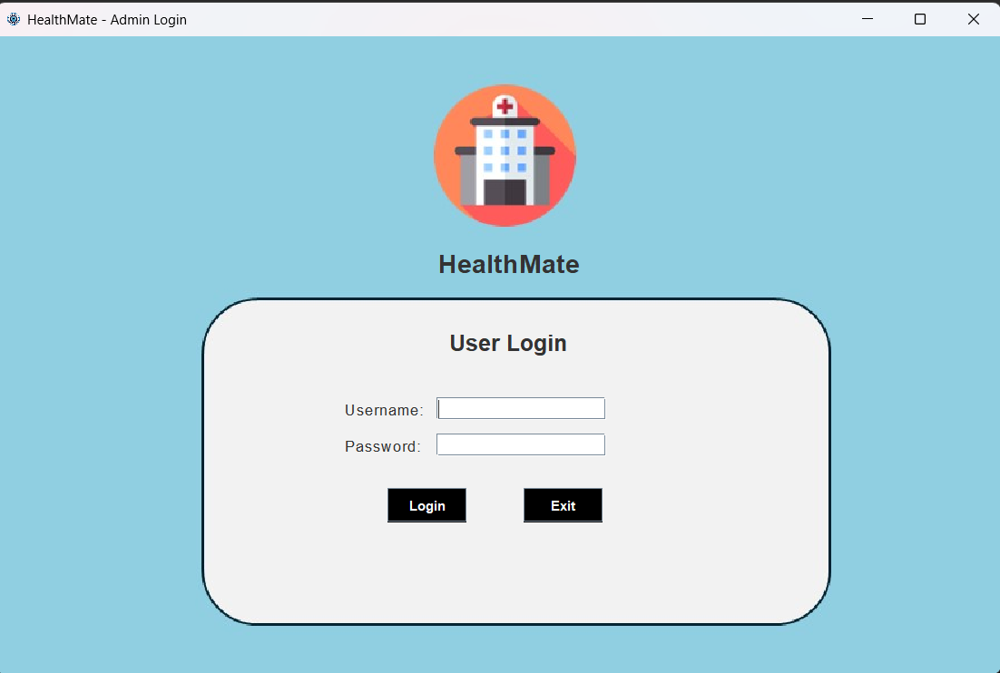
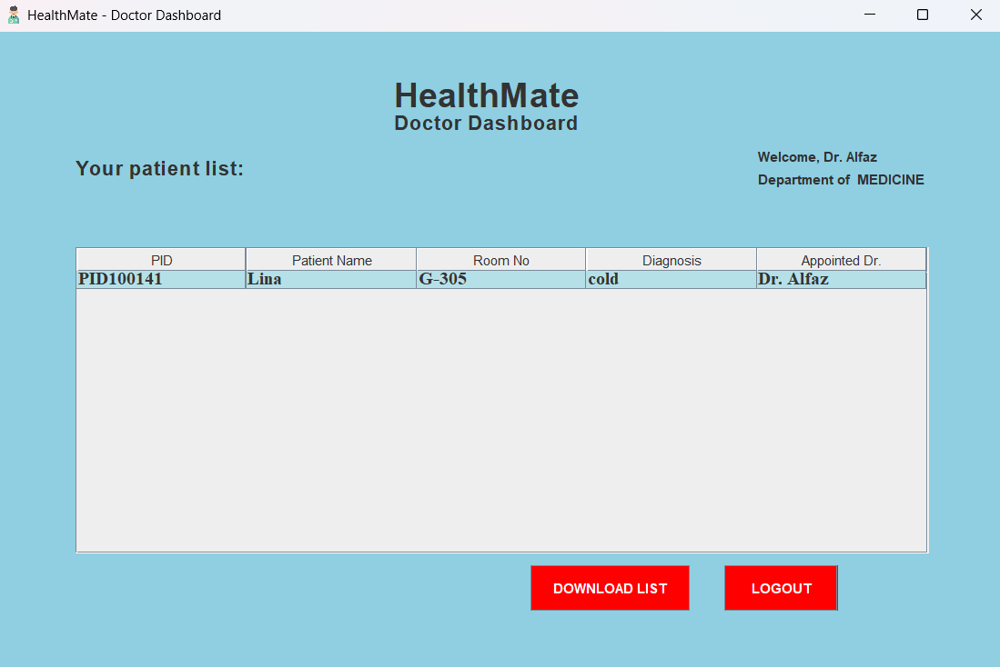
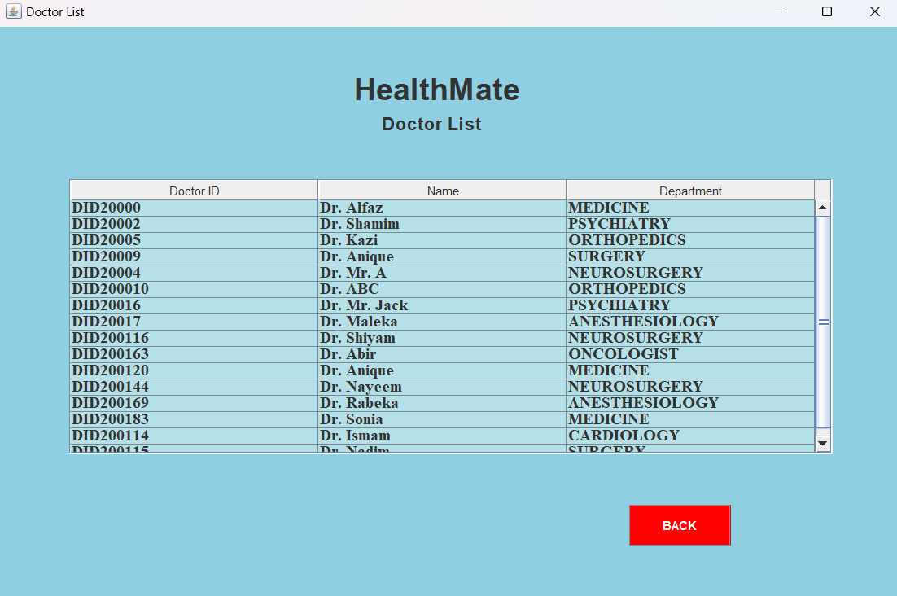
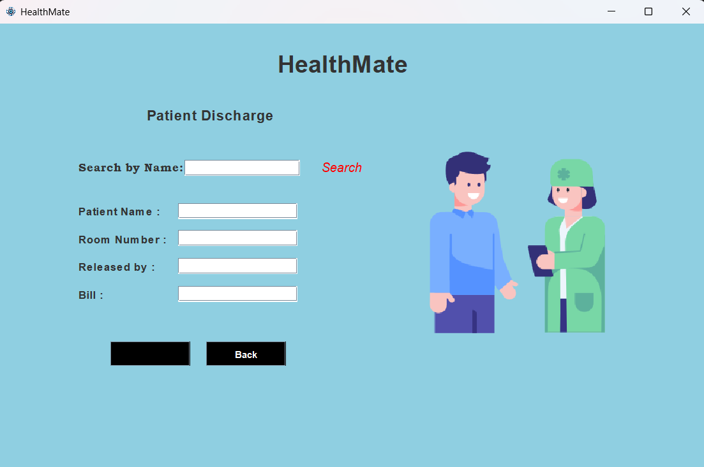
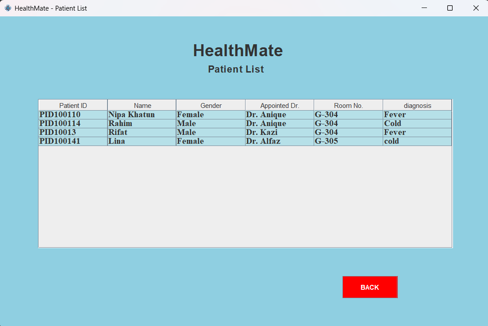

# Hospital-Management-Project
This is a Java based Hospital Management System project.
This project was made for the course Object Oriented Programming-1 (Java) by the students of **American International University-Bangladesh (AIUB)** and guided by **UMME SADIA SALSABIL**, ***LECTURER,AIUB***.
Team members are -  **@UDDIN, MD.ALFAZ @SHAMIM, MD. SHAFAYAT HOSSAIN @RIYAD, KAZI FARDIN RAHMAN @DAS, ANIQUE KUMAR**

# In this  project -
📌The admin can login and control the management system. 
📌By default the username and password is "admin" 
📌Admin can add new patient, update the patient information, search and discharge patients from the dashboard. 
📌Doctors can Register by filling the required informations. 
📌Doctors can login to their dashboard and can see the patients assigned to them. 
📌Doctors can download their patient list in .doc file. 

# 🔗Project web - https://alfaaz-uddin.github.io/HealthMate/ 

